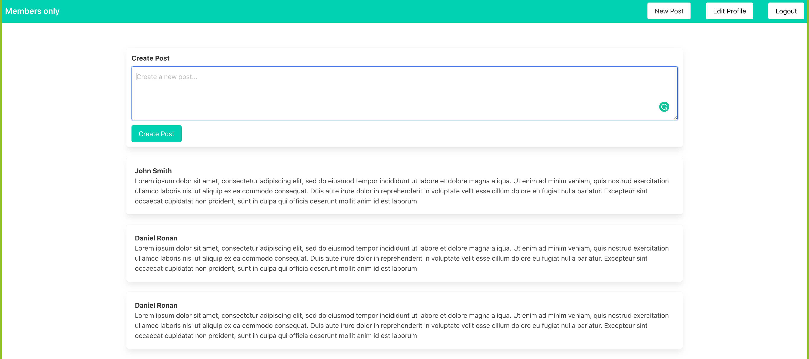

# Members Only

> The purpose of the project was to create a post feed where users can create their posts.
## Library Directory 📙
 
| Contents        |
| ------------- |
| [Built With](#built-with-🛠) |
| [Install](#install-⏳) |
| [Authors](#authors) | 
| [License](#license) | 



## Description

We built a working app that lets you create your posts, multiple users with name, username, email and password and the ability to edit your account details.

## Built With 🛠
```
- Ruby: 2.6.3
- Ruby on Rails: 6.0.3.4
- Bulma
- Devise
- SQLite
- VS Code
```

## Install ⏳

> Follow these steps below to get our application working

1. - [ ] Open your `Terminal`
2. - [ ] Navigate to the directory where you will like to install the repo by running `cd FOLDER-NAME`
3. - [ ] Run `git clone git@github.com:DcRonan/members-only.git` to download <b>or</b> you can download using `HTTPS` by running `git clone https://github.com/DcRonan/members-only.git` in the terminal
4. - [ ] Run `cd members-only` to enter the directory
5. - [ ] Run `bundle install` to install Ruby Gems (<b>hint:</b> Mac users, if not working then run `sudo bundle install`)
6. - [ ] Run `rails db:create` to create your database
7. - [ ] Run `rails db:migrate` to migrate your database
8. - [ ] Run `rails s` to get the server running
9. - [ ] Enter `http://localhost:3000/` in the browser to get the app running

## Authors

### 👨‍💻 Daniel Ronan
[](https://github.com/DcRonan) <br>
[](https://www.linkedin.com/in/danronan10/) <br>
[](mailto:danielconnorronan@gmail.com) <br>
[](https://twitter.com/dc_ronan)

### 👨‍💻 Khalil Hamdi
[](https://github.com/khalilhamdii) <br>
[](https://www.linkedin.com/in/khalilhamdi/) <br>
[](mailto:khaalil.hamdi@gmail.com) <br>
[](https://twitter.com/Khalilhamdiii)

### 🤝 Contributing

Contributions, issues and feature requests are welcome!

Feel free to check the [issues page](https://github.com/DcRonan/members-only/issues).

### Show your support

Give a ⭐️ if you like this project!

### License


